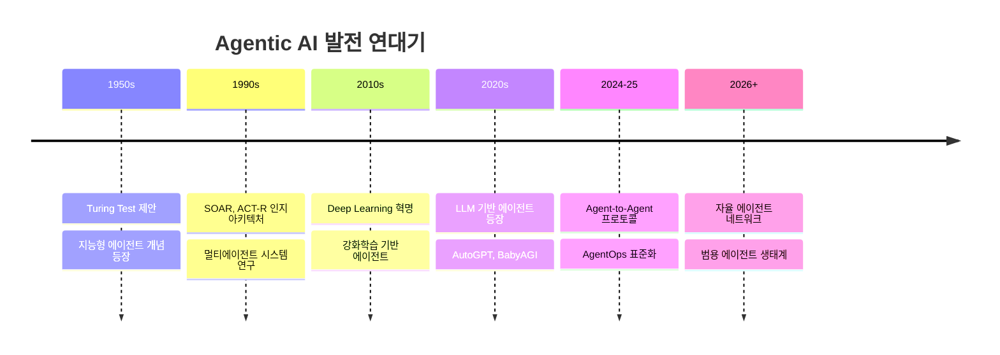

# Agentic AI: 자율적 AI 시스템의 부상

> "2026년, 우리는 AI가 단순한 도구에서 자율적인 협력 파트너로 진화하는 역사적 전환점에 서 있다."

## 1. 서론 (Introduction)

### 1.1 연구 배경 및 동기

인공지능 기술은 2020년대 들어 기하급수적인 발전을 이루었다. 특히 대규모 언어 모델(Large Language Models, LLMs)의 등장은 AI 시스템의 능력을 새로운 차원으로 끌어올렸다. 그러나 기존의 AI 시스템들은 대부분 **반응형(Reactive)** 패러다임에 머물러 있었다. 사용자가 질문하면 답변하고, 명령하면 실행하는 수동적인 역할에 그쳤던 것이다.

**Agentic AI**는 이러한 한계를 근본적으로 극복한다. Agentic AI는 스스로 목표를 설정하고, 계획을 수립하며, 환경과 상호작용하면서 작업을 완수하는 **자율적인 AI 시스템**을 의미한다.

### 1.2 Agentic AI의 정의

```
Agentic AI (에이전틱 AI)
: 주어진 목표를 달성하기 위해 자율적으로 추론하고, 계획하며,
  도구를 활용하고, 환경과 상호작용하는 AI 시스템
```

핵심 특성:
- **자율성 (Autonomy)**: 인간의 지속적인 개입 없이 작업 수행
- **목표 지향성 (Goal-Orientation)**: 명확한 목표를 향해 행동
- **적응성 (Adaptability)**: 환경 변화에 따라 전략 수정
- **도구 활용 (Tool Use)**: 외부 도구와 API를 활용한 작업 수행
- **추론 능력 (Reasoning)**: 복잡한 문제를 단계별로 분해하여 해결

### 1.3 연구 목적 및 범위

본 문서는 다음을 목표로 한다:

1. Agentic AI의 이론적 기반과 핵심 개념 정립
2. Agent-to-Agent (A2A) 통신 프로토콜의 기술적 분석
3. AgentOps (에이전트 운영) 패러다임의 체계적 정리
4. 실제 산업 적용 사례 및 구현 예제 제공
5. 2026년 이후 발전 방향 예측

---

## 2. Agentic AI의 이론적 기반

### 2.1 역사적 발전 과정



### 2.2 인지 아키텍처 (Cognitive Architecture)

Agentic AI의 핵심은 **인지 아키텍처**에 있다. 현대 Agentic AI는 다음과 같은 구성 요소를 가진다:

```
┌─────────────────────────────────────────────────────────┐
│                    AGENTIC AI ARCHITECTURE              │
├─────────────────────────────────────────────────────────┤
│  ┌─────────────┐  ┌─────────────┐  ┌─────────────┐     │
│  │   PERCEIVE  │→│   REASON    │→│    ACT      │     │
│  │   (인지)    │  │   (추론)    │  │   (실행)    │     │
│  └─────────────┘  └─────────────┘  └─────────────┘     │
│         ↑                                    ↓          │
│  ┌─────────────────────────────────────────────────┐   │
│  │              MEMORY (기억 시스템)                │   │
│  │  ┌──────────┐  ┌──────────┐  ┌──────────┐      │   │
│  │  │ Working  │  │ Episodic │  │ Semantic │      │   │
│  │  │ Memory   │  │ Memory   │  │ Memory   │      │   │
│  │  └──────────┘  └──────────┘  └──────────┘      │   │
│  └─────────────────────────────────────────────────┘   │
│         ↑                                    ↓          │
│  ┌─────────────────────────────────────────────────┐   │
│  │              TOOLS & ENVIRONMENT                 │   │
│  │   [API] [Database] [Code Exec] [Web Search]     │   │
│  └─────────────────────────────────────────────────┘   │
└─────────────────────────────────────────────────────────┘
```

#### 2.2.1 기억 시스템 (Memory System)

| 유형 | 설명 | 예시 |
|------|------|------|
| **작업 기억 (Working Memory)** | 현재 작업 맥락과 즉시 필요한 정보 | 현재 대화 컨텍스트, 진행 중인 작업 상태 |
| **일화 기억 (Episodic Memory)** | 과거 경험과 상호작용 기록 | 이전 대화 이력, 완료된 작업 로그 |
| **의미 기억 (Semantic Memory)** | 일반적 지식과 학습된 정보 | 도메인 지식, 사용자 선호도 |

### 2.3 ReAct 패러다임

ReAct (Reasoning + Acting)는 현대 Agentic AI의 핵심 패러다임이다:

```python
# ReAct 패턴의 의사 코드
def react_loop(goal: str) -> Result:
    """
    ReAct: Reasoning과 Acting의 반복적 순환
    """
    context = initialize_context(goal)

    while not goal_achieved(context):
        # 1. Reasoning: 현재 상황 분석 및 계획 수립
        thought = reason(context)

        # 2. Acting: 적절한 행동 선택 및 실행
        action = select_action(thought)

        # 3. Observation: 결과 관찰 및 피드백
        observation = execute_action(action)

        # 4. Context Update: 새로운 정보로 맥락 갱신
        context = update_context(context, observation)

    return context.result
```

### 2.4 에이전트 유형 분류

```
                    자율성 수준
                        ↑
                        │
    Level 4: ┌──────────┴──────────┐
   자율 에이전트│  Autonomous Agent   │ 완전 자율 의사결정
             └──────────┬──────────┘
                        │
    Level 3: ┌──────────┴──────────┐
  협업 에이전트│ Collaborative Agent │ 다중 에이전트 협업
             └──────────┬──────────┘
                        │
    Level 2: ┌──────────┴──────────┐
  도구 에이전트│    Tool Agent       │ 도구 활용 가능
             └──────────┬──────────┘
                        │
    Level 1: ┌──────────┴──────────┐
  반응 에이전트│   Reactive Agent    │ 단순 응답
             └──────────┴──────────┘
                        │
    ────────────────────┴──── 복잡성 →
```

---

## 3. 핵심 기술 구성 요소

### 3.1 계획 수립 (Planning)

에이전트의 계획 수립 능력은 복잡한 작업을 수행하는 데 필수적이다:

```python
from typing import List, Dict

class HierarchicalPlanner:
    """
    계층적 작업 분해 (Hierarchical Task Decomposition)
    복잡한 목표를 하위 작업으로 분해
    """

    def decompose(self, goal: str) -> List[Task]:
        """
        목표를 실행 가능한 하위 작업으로 분해
        """
        # 1. 목표 분석
        analysis = self.analyze_goal(goal)

        # 2. 하위 목표 생성
        sub_goals = self.generate_subgoals(analysis)

        # 3. 의존성 분석
        dependencies = self.analyze_dependencies(sub_goals)

        # 4. 실행 계획 생성
        execution_plan = self.create_execution_plan(
            sub_goals, dependencies
        )

        return execution_plan

    def replan(self,
               current_state: State,
               failed_task: Task) -> List[Task]:
        """
        실패 시 동적 재계획 (Dynamic Replanning)
        """
        # 실패 원인 분석
        failure_analysis = self.analyze_failure(failed_task)

        # 대안 전략 생성
        alternatives = self.generate_alternatives(
            failure_analysis, current_state
        )

        # 최적 대안 선택
        return self.select_best_alternative(alternatives)
```

### 3.2 도구 사용 (Tool Use)

현대 Agentic AI의 핵심 역량 중 하나는 외부 도구 활용이다:

```typescript
// 도구 정의 인터페이스
interface Tool {
  name: string;
  description: string;
  parameters: JSONSchema;
  execute: (params: any) => Promise<ToolResult>;
}

// 도구 레지스트리
class ToolRegistry {
  private tools: Map<string, Tool> = new Map();

  register(tool: Tool): void {
    this.tools.set(tool.name, tool);
  }

  async execute(
    toolName: string,
    params: any
  ): Promise<ToolResult> {
    const tool = this.tools.get(toolName);
    if (!tool) throw new Error(`Unknown tool: ${toolName}`);

    // 파라미터 검증
    this.validateParams(params, tool.parameters);

    // 도구 실행
    return await tool.execute(params);
  }
}

// 예시: 웹 검색 도구
const webSearchTool: Tool = {
  name: "web_search",
  description: "Search the web for current information",
  parameters: {
    type: "object",
    properties: {
      query: { type: "string", description: "Search query" },
      num_results: { type: "number", default: 10 }
    },
    required: ["query"]
  },
  execute: async (params) => {
    // 실제 검색 로직
    return await performWebSearch(params.query, params.num_results);
  }
};
```

### 3.3 자기 반성 (Self-Reflection)

고급 에이전트는 자신의 행동을 평가하고 개선하는 능력을 갖는다:

```python
class ReflectiveAgent:
    """
    자기 반성 능력을 갖춘 에이전트
    Reflexion 논문 (Shinn et al., 2023) 기반
    """

    def reflect(self,
                trajectory: List[Action],
                outcome: Outcome) -> Reflection:
        """
        행동 궤적과 결과를 분석하여 개선점 도출
        """
        reflection_prompt = f"""
        ## 작업 분석

        목표: {self.current_goal}
        수행한 행동들: {trajectory}
        결과: {outcome}

        ## 반성 질문
        1. 목표 달성에 성공했는가?
        2. 어떤 행동이 효과적이었는가?
        3. 어떤 행동이 비효율적이었는가?
        4. 다음에는 어떻게 개선할 수 있는가?

        위 질문에 대해 심층적으로 분석하고 개선 방안을 제시하라.
        """

        reflection = self.llm.generate(reflection_prompt)

        # 반성 내용을 장기 기억에 저장
        self.memory.store_reflection(reflection)

        return reflection
```

---

## 4. 주요 프레임워크 및 도구

### 4.1 프레임워크 비교

| 프레임워크 | 주요 특징 | 사용 사례 | 장단점 |
|-----------|----------|----------|-------|
| **LangChain** | 체인 기반 파이프라인, 다양한 통합 | 범용 에이전트 | 유연하나 복잡 |
| **LangGraph** | 그래프 기반 워크플로우, 상태 관리 | 복잡한 워크플로우 | 강력한 제어 흐름 |
| **CrewAI** | 역할 기반 멀티에이전트 | 팀 협업 시뮬레이션 | 직관적 설계 |
| **AutoGen** | 대화형 에이전트 협업 | 코드 생성, 분석 | MS 지원, 확장성 |
| **Semantic Kernel** | 엔터프라이즈 통합 | 기업용 AI | 보안, 안정성 |

### 4.2 선택 가이드

```
질문: 어떤 프레임워크를 선택해야 하나?

┌─────────────────────────────────────────────────────┐
│                   의사결정 트리                      │
├─────────────────────────────────────────────────────┤
│                                                      │
│  단일 에이전트가 필요한가?                           │
│       │                                              │
│       ├─ Yes → 간단한 작업인가?                      │
│       │         ├─ Yes → LangChain (간단)           │
│       │         └─ No  → LangGraph (복잡)           │
│       │                                              │
│       └─ No (멀티에이전트) → 대화형 협업인가?        │
│                  ├─ Yes → AutoGen                   │
│                  └─ No  → 역할 기반인가?            │
│                           ├─ Yes → CrewAI           │
│                           └─ No  → LangGraph       │
│                                                      │
└─────────────────────────────────────────────────────┘
```

---

## 5. 2026년 전망: 다가올 에이전트의 미래

### 5.1 예상되는 발전 방향

```
2026년 Agentic AI 전망
━━━━━━━━━━━━━━━━━━━━━━━━━━━━━━━━━━━━━━━━━

🤖 자율성 증대
   • 장기 목표 자율 추구
   • 복잡한 프로젝트 독립 수행
   • 인간 개입 최소화

🌐 에이전트 네트워크
   • 표준화된 A2A 프로토콜
   • 글로벌 에이전트 마켓플레이스
   • 자율적 에이전트 생태계

🧠 인지 능력 향상
   • 장기 기억 및 학습
   • 상황 인식 및 적응
   • 창의적 문제 해결

🔒 안전성 및 정렬
   • 가치 정렬 기술 성숙
   • 감사 가능한 의사결정
   • 인간 통제 보장

💼 산업 적용 확대
   • 범용 비즈니스 에이전트
   • 과학 연구 자동화
   • 개인화된 AI 비서
```

### 5.2 해결해야 할 과제

1. **안전성 (Safety)**: 자율 에이전트의 예측 불가능한 행동 방지
2. **정렬 (Alignment)**: 인간의 가치와 목표에 부합하는 행동 보장
3. **투명성 (Transparency)**: 에이전트 의사결정 과정의 설명 가능성
4. **책임 (Accountability)**: 에이전트 행동에 대한 법적, 윤리적 책임
5. **상호운용성 (Interoperability)**: 다양한 에이전트 간 원활한 협력

---

## 다음 단계

이 문서 시리즈에서는 다음 주제들을 심층적으로 다룹니다:

- [**Agent-to-Agent 통신**](/docs/agent-to-agent/overview): 에이전트 간 통신 프로토콜과 표준
- [**AgentOps**](/docs/agentops/overview): 에이전트 운영 및 관리 패러다임
- [**아키텍처 설계**](/docs/architecture/patterns): 에이전트 시스템 설계 패턴
- [**실전 예제**](/docs/practical/case-studies): 산업별 적용 사례와 구현

---

## 참고 문헌

1. Yao, S., et al. (2023). "ReAct: Synergizing Reasoning and Acting in Language Models." ICLR 2023.
2. Shinn, N., et al. (2023). "Reflexion: Language Agents with Verbal Reinforcement Learning." NeurIPS 2023.
3. Park, J. S., et al. (2023). "Generative Agents: Interactive Simulacra of Human Behavior." UIST 2023.
4. AutoGPT Team. (2023). "Auto-GPT: An Autonomous GPT-4 Experiment."
5. Google. (2024). "Agent-to-Agent (A2A) Protocol Specification."
6. Anthropic. (2024). "Model Context Protocol (MCP) Specification."
